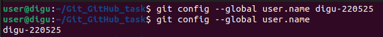
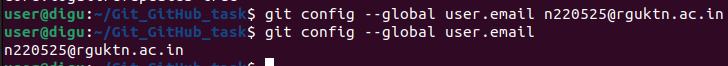
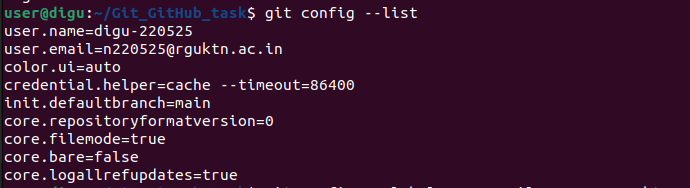
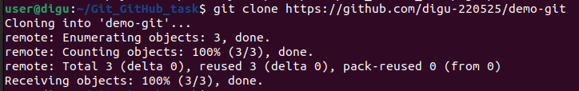
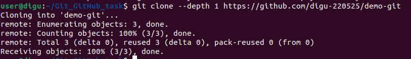
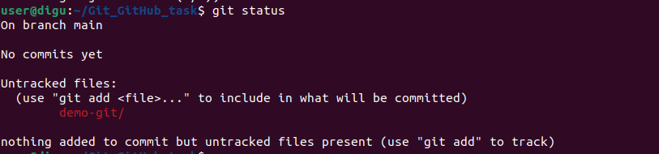
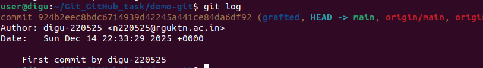

# Git Industry-Level Commands Practice

**Repository Name:** your-repo-name  
**Author:** Your Name  
**Purpose:** Industry-level Git & GitHub command documentation with execution proof.

---

# Git Configuration Commands

## 1.1 git config --global user.name

### Syntax
```bash
git config --global user.name "Your Name"
```

### Purpose
Sets the global username for all repositories.

### Example
```bash
git config --global user.name "Digu Baditya"
```

### Screenshot Proof

---

## 1.2 git config --global user.email

### Syntax
```bash
git config --global user.email "your@email.com"
```

### Purpose
Sets the global email for Git commits.

### Example
```bash
git config --global user.email "digu@example.com"
```

### Screenshot Proof


---

## 1.3 git config --list

### Syntax
```bash
git config --list
```

### Purpose
Displays all configured Git settings.

### Screenshot Proof

---

## 1.4 git config --unset

### Syntax
```bash
git config --unset user.name
```

### Purpose
Removes a configuration value.

### Screenshot Proof


---

# Repository Setup Commands

## 2.1 git init

### Syntax
```bash
git init
```

### Purpose
Initializes a new Git repository.

### Screenshot Proof


---

## 2.2 git clone

### Syntax
```bash
git clone <repository-url>
```

### Purpose
Creates a local copy of a remote repository.

### Screenshot Proof


---

## 2.3 git clone --branch

### Syntax
```bash
git clone --branch branch-name <repository-url>
```

### Purpose
Clones a specific branch only.

### Screenshot Proof
(Add screenshot here)

---

## 2.4 git clone --depth

### Syntax
```bash
git clone --depth 1 <repository-url>
```

### Purpose
Performs shallow clone with limited commit history.

### Screenshot Proof


---

# Repository Status & Inspection

## 3.1 git status

```bash
git status
```

Shows working directory status.

### Screenshot Proof


---

## 3.2 git log

```bash
git log
```

Shows full commit history.

### Screenshot Proof



---

## 3.3 git log --oneline

```bash
git log --oneline
```
### Screenshot Proof


Compact commit history.

---


---

## 3.4 git log --graph

### Syntax
```bash
git log --graph --oneline --all
```

### Purpose
Displays branch graph visually.

### Screenshot Proof


Displays branch graph visually.

---


---

## 3.5 git show

### Syntax
```bash
git show <commit-hash>
```

### Purpose
Shows details of a commit.

### Example
```bash
git show f7c3a4f
```

### Screenshot Proof


---


---

## 3.6 git diff

### Syntax
```bash
git diff
```

### Purpose
Shows unstaged changes.

### Screenshot Proof


---

## 3.7 git diff --staged

```bash
git diff --staged
```
### Screenshot Proof


Shows staged changes.

---

## 3.8 git blame

```bash
git blame filename
```

Shows who modified each line.

### Screenshot Proof


---

## 3.9 git reflog

```bash
git reflog
```

Shows reference history (HEAD movements).
### Screenshot Proof


---

## 3.10 git shortlog

```bash
git shortlog
```

Summarizes commits by author.

### Screenshot Proof

---

# File Tracking Commands

## 4.1 git add

```bash
git add filename
```

Stages specific file.

### Screenshot Proof

---

## 4.2 git add .

```bash
git add .
```

Stages all changes.

### Screenshot Proof


---

## 4.3 git add -p

```bash
git add -p
```

Stages changes interactively.Asking permission to stage or not for all fles that are chnaged.

### Screenshot Proof


---

## 4.4 git restore

```bash
git restore filename
```

Restores working directory file.
If you changes something to a staged file then that changes will be lost

### Screenshot Proof

---

## 4.5 git restore --staged

```bash
git restore --staged filename
```

Unstages file.

---

## 4.6 git rm

```bash
git rm filename
```

Removes file from repository.

---

## 4.7 git mv

```bash
git mv oldname newname
```

Renames or moves file.

---

# Commit Commands

## 5.1 git commit

```bash
git commit
```

Opens editor for commit message.

---

## 5.2 git commit -m

```bash
git commit -m "Commit message"
```

Creates commit with message.

---

## 5.3 git commit --amend

```bash
git commit --amend
```

Modifies last commit.

---

## 5.4 git commit --no-edit

```bash
git commit --amend --no-edit
```

Amends commit without changing message.

---

# Branch Management Commands

## 6.1 git branch

```bash
git branch
```

Lists local branches.

---

## 6.2 git branch -a

```bash
git branch -a
```

Lists local & remote branches.

---

## 6.3 git branch -d

```bash
git branch -d branch-name
```

Deletes merged branch.

---

## 6.4 git branch -D

```bash
git branch -D branch-name
```

Force deletes branch.

---

## 6.5 git checkout

```bash
git checkout branch-name
```

Switches branch.

---

## 6.6 git checkout -b

```bash
git checkout -b new-branch
```

Creates & switches branch.

---

## 6.7 git switch

```bash
git switch branch-name
```

Modern branch switching.

---

## 6.8 git switch -c

```bash
git switch -c new-branch
```

Creates & switches branch.

---

---

# Final Submission

```bash
git add git_industry_commands.md
git commit -m "Added industry level Git commands practice"
git push
```